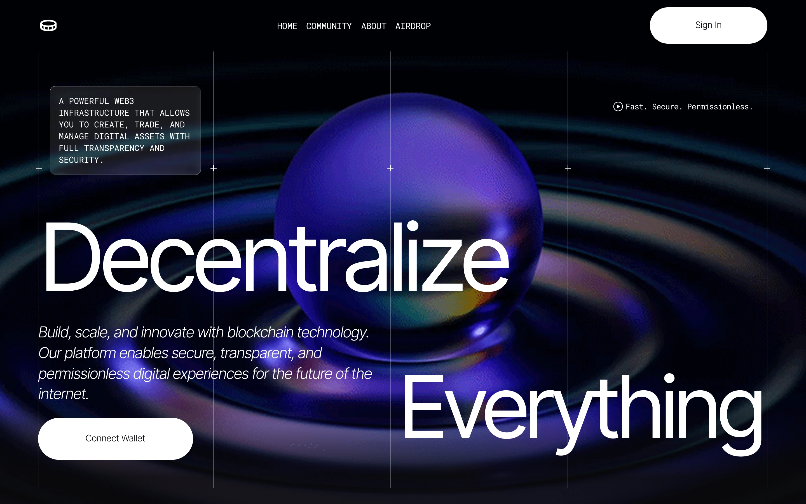

# Pixory Flow

Modern responsive Web3 landing page built with Next.js and Tailwind CSS.



## Tech Stack

- Next.js
- TypeScript
- Tailwind CSS
- Framer Motion

## Features

- Responsive modern UI
- Animated hero section
- GIF/video background
- Mobile navigation
- Glassmorphism effects
- Interactive CTA buttons


## Getting Started

```bash
npm run dev
# or
yarn dev
# or
pnpm dev
# or
bun dev
```

Open [http://localhost:3000](http://localhost:3000) to explore the platform.

## Project Structure
- `app/`: Next.js App Router pages and layouts
- `components/`: Reusable UI components (Navbar, Hero, etc.)
- `public/`: Static assets (logo, background images, icons)
- `lib/`: Business logic and utilities (if added later)

## Deployment
Deploy effortlessly to Vercel with one click using the [Vercel Platform](https://vercel.com/new?utm_medium=default-template&filter=next.js&utm_source=create-next-app&utm_campaign=create-next-app-readme).
